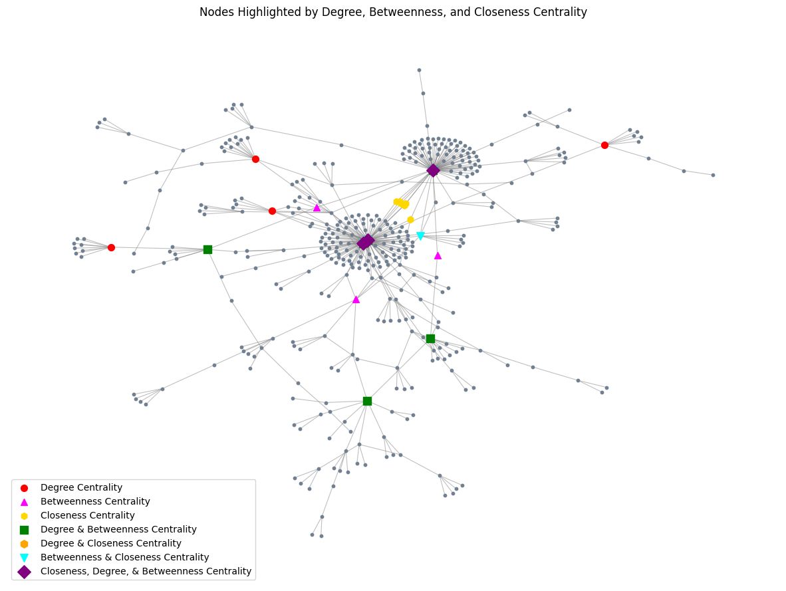

# 图神经网络项目总结

本项目基于Elliptic比特币交易数据集，使用图神经网络（GNN）进行节点分类任务，识别合法交易（licit）和非法交易（illicit）。项目包含数据分析和模型训练两个主要部分。

### 数据集
- **节点**: 203,769 个交易节点，166 维特征
- **边**: 234,355 条交易关系
- **数据划分**: 训练集80% / 验证集10% / 测试集10%
- **任务**: 二分类（合法/非法交易）

## 数据分析

数据分析notebook (`数据分析.ipynb`) 包含以下内容：

1. **基础统计**: 节点和边的分布情况
2. **度分布分析**: 识别高度连接的节点（可能是团伙头目）
3. **中心性分析**:
   - 度中心性（Degree Centrality）
   - 中介中心性（Betweenness Centrality）
   - 接近中心性（Closeness Centrality）
   
4. **社区检测**: 使用Louvain算法识别交易团伙
   
5. **可视化**: 网络结构可视化，突出重要节点

## 模型实现


| 模型 | 学习率 | 隐藏层维度 | Dropout | 注意力头数 | 准确率 | F1分数 | 精准度 | 召回率 |
|------|--------|-----------|---------|-----------|--------|--------|--------|--------|
| **GCN** | 0.01 | 64 | 0.3 | - | 95.98% | 95.72% | 95.81% | 95.98% |
| **GAT** | 0.005 | 32 | 0.3 | 4 | 96.93% | 96.83% | 96.83% | 96.93% |
| **GIN** | 0.005 | 32 | 0.3 | - | 96.71% | 96.67% | 96.64% | 96.71% |

## 模型对比

### GCN vs GAT vs GIN 的区别

| 特性 | GCN (图卷积网络) | GAT (图注意力网络) | GIN (图同构网络) |
|------|----------------|------------------|----------------|
| **核心思想** | 使用固定的归一化邻接矩阵进行消息传递 | 使用注意力机制学习邻居节点的重要性权重 | 使用多层感知机（MLP）进行特征变换，理论上表达能力最强 |
| **聚合方式** | 对邻居节点特征进行平均聚合，权重由度矩阵归一化决定 | 通过注意力分数动态加权聚合邻居特征 | 通过可学习的MLP对节点和邻居特征进行非线性变换 |
| **优点** | • 计算效率高，实现简单<br>• 适合处理大规模图数据 | • 能够学习不同邻居的重要性<br>• 多头注意力机制增强表达能力<br>• 对图结构变化更鲁棒 | • 理论保证：能够区分不同的图结构（Weisfeiler-Lehman测试）<br>• 表达能力最强，适合复杂图结构<br>• 可学习的epsilon参数增强灵活性 |
| **缺点** | • 无法区分不同邻居的重要性<br>• 表达能力相对有限 | • 计算复杂度较高<br>• 需要更多超参数调优（注意力头数） | • 参数量较大<br>• 训练时间相对较长 |

### 性能对比总结

| 模型 | 准确率 | 特点 |
|------|--------|------|------|
| **GAT** | 96.93% | 得益于注意力机制能够更好地捕捉交易网络中的关键关系 |
| **GIN** | 96.71% | 展现了强大的表达能力 |
| **GCN** | 95.98% | 虽然准确率稍低，但计算效率最高，适合快速原型开发 |

## 项目结构

```
.
├── 数据分析.ipynb           # 数据探索和可视化
├── 图模型.ipynb             # GCN/GAT/GIN模型实现和训练
├── dataset_download.py      # 数据集下载
├── images/                  # 项目运行结果图片
└── README.md                # 项目说明文档
```

## 主要成果

1. ✅ 成功实现三种主流图神经网络模型
2. ✅ 通过网格搜索找到最佳超参数配置
3. ✅ 在比特币交易欺诈检测任务上达到96%+的准确率
4. ✅ 深入理解不同GNN架构的特点和适用场景
5. ✅ 完成完整的数据分析和模型评估流程
