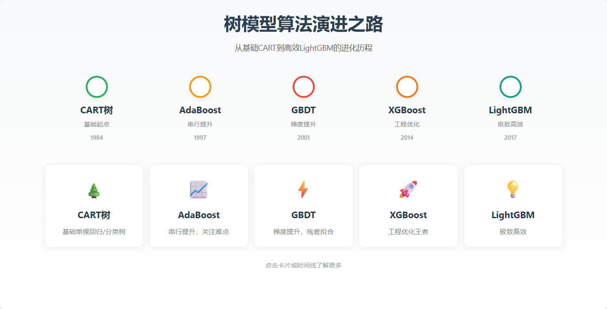

# 决策树算法演进网页

一个美观、交互式的网页展示，介绍从CART树到LightGBM的算法演进历程。

## 🚀 快速开始

双击 `index.html` 即可在浏览器中打开浏览。

## 📝 算法介绍

1. **CART树** - 基础起点，易过拟合
2. **AdaBoost** - 串行提升，关注难点
3. **GBDT** - 梯度提升，残差拟合
4. **XGBoost** - 工程优化王者
5. **LightGBM** - 极致高效

## 🎨 特点

- 白色主色调，清新简洁
- 交互式时间线展示算法演进
- 每个算法独立详情页，包含通俗解释和公式
- 响应式设计，支持移动端

